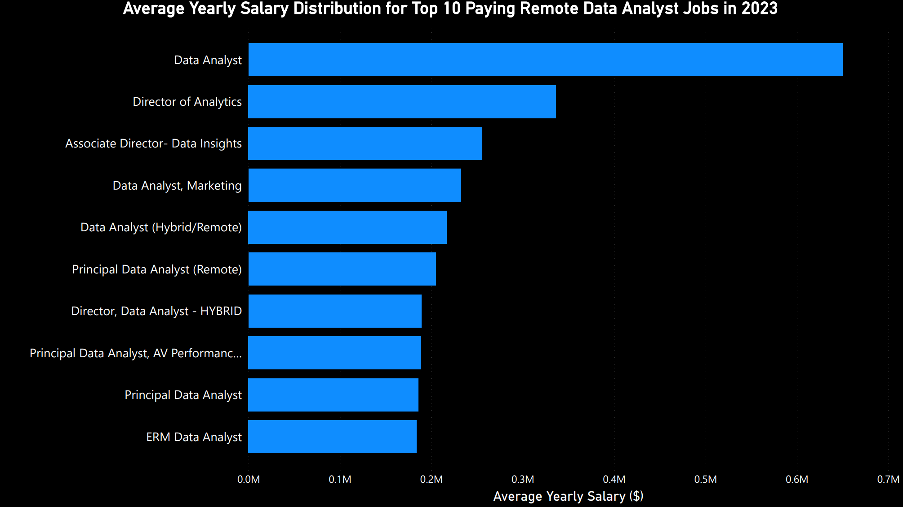
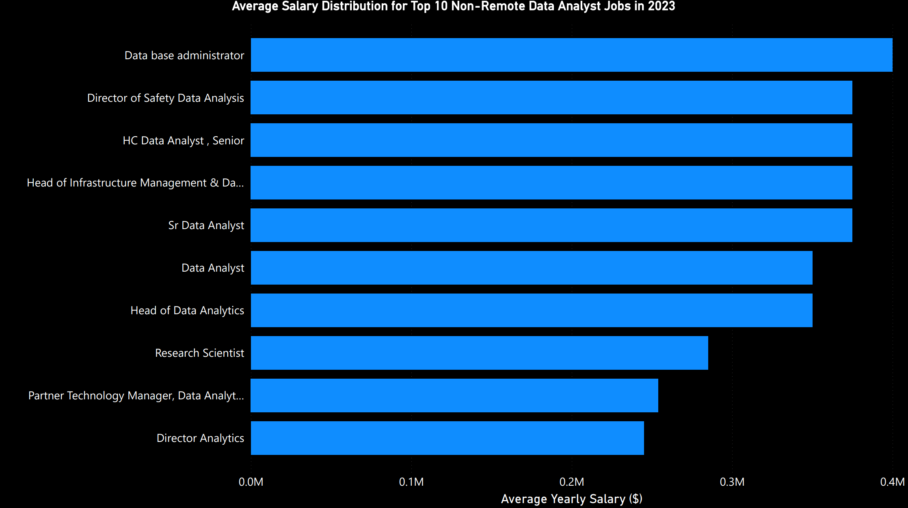
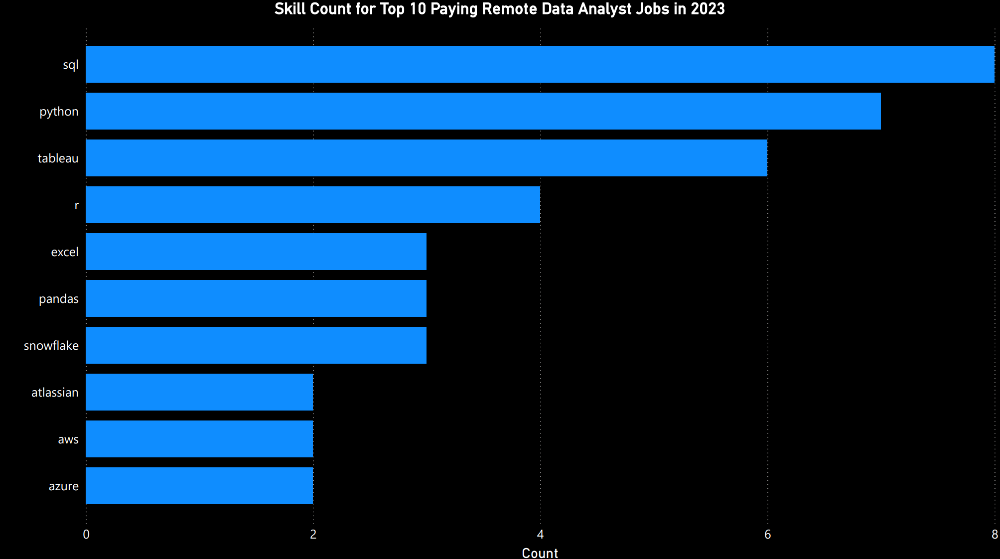

 # Introduction
 This project revolves around the DATA JOBS MARKET and involves analysis resulting in writing queries to answer questions related to top paying jobs, skills in high demand and much more, with main focus on DATA ANALYST JOBS.

 To check the SQL queries go to [project_sql Folder](/project_sql/)

 # Background
 Given this is my first SQL project ever, I wanted it to be related to my actual goal, which is to become  a data analyst. The Data used in the course is based on the online course [SQL for Data Analytics](https://www.lukebarousse.com/sql) by [Luke Barousse](https://github.com/lukebarousse).

 **The main task of the Project was to analyze the Data Jobs Market, specifically the Data Analyst Jobs. This was achieved by making SQL queries to answer the following questions:**

1. What are the top-paying data analyst jobs?
2. What skills are required for these top-paying jobs?
3. What skills are most in demand for data analysts?
4. Which skills are associated with higher salaries?
5. What are the most optimal skills to learn? 

 # Tools Used
It was my first time using all of these tools, I do have experience with other tools like Jupyter, MATLAB , and other editors, but VS code really stood out to me, work of such ease and very versatile tool.

- **SQL:** The coding language for the whole project.
- **PostgreSQL:** The chosen database management system, ideal for handling the job posting data.
- **Visual Studio Code:** Best tool for this project.
- **Power BI:** Used to create graphics.
- **Git & GitHub:** Essential for version control and sharing my SQL scripts and analysis, ensuring collaboration and project tracking.
 # The Analysis

 Each query was directed at a main task, followed by sub-tasks with respect to each question.
 My approach is as follows:

 ### 1. Top Paying Data Analyst Jobs

This was easy. To identify the highest-paying roles, I filtered data analyst positions by average yearly salary, making sure it's non-zero, and location based on remote jobs. The LEFT join was used as a bonus task to get company names for the required Jobs.

This query highlights the top 10 high paying opportunities in the field.
``` sql
SELECT 
    job_id,
    job_schedule_type,
    job_location,
    job_title,
    job_title_short,
    salary_year_avg,
    job_posted_date,
    name as company_name

FROM 
    job_postings_fact

LEFT JOIN company_dim ON job_postings_fact.company_id = company_dim.company_id

WHERE 
    job_title_short = 'Data Analyst' AND 
    job_location = 'Anywhere' AND
    salary_year_avg IS NOT NULL

ORDER BY 
    salary_year_avg DESC
LIMIT 10 
```


_Bar graph describing average yearly salaries for the Top 10 remote data analysts postions. Created using Power BI._

Breakdown of the top data analyst jobs in 2023:

- **Wide Salary Range:** Top 10 paying data analyst roles span from $184,000 to $650,000, indicating significant salary potential in the field.

- **Job Title Variety:** There's a high diversity in job titles, from Data Analyst to Director of Analytics, reflecting varied roles and specializations within data analytics.

Going beyond the ask of the project, I created the same graph but for non-remote jobs to get a bit more of a comparison.

Here's the result:


_Bar graph describing average yearly salaries for the Top 10 non-remote data analysts postions. Created using Power BI._

And the results:

- **No Wide Salary Range:** Top 10 paying data analyst roles span from $245,000 to $400,000, compared to Remote postitions, Non-Remote positions do not offer much wider salary range and highest salary is also lower, implying lower salary potential.

- **Job Title Variety:** There's still a high diversity in job titles, from Data base administrator to Director of Analytics, reflecting varied roles and specializations within data analytics.


### 2. Skills for Top Paying Jobs

To get the skills for the high paying jobs, I (Inner) Joined the Job Postings and Skills table. Formatting the results in terms of skills vs skill count, I got insights into what skills are in high demand when it comes to Data Analyst Roles.

```sql
WITH top_paying_jobs AS (
    SELECT 
        job_id,
        job_title,
        salary_year_avg,
        name AS company_name
    FROM 
        job_postings_fact
    LEFT JOIN company_dim ON job_postings_fact.company_id = company_dim.company_id
    WHERE 
        job_title_short = 'Data Analyst' AND 
        job_location = 'Anywhere' AND
        salary_year_avg IS NOT NULL
    ORDER BY 
        salary_year_avg DESC
    LIMIT 10
)
SELECT 
    top_paying_jobs.*,
    skills
FROM top_paying_jobs
INNER JOIN skills_job_dim ON top_paying_jobs.job_id= skills_job_dim.job_id
INNER JOIN skills_dim ON skills_job_dim.skill_id = skills_dim.skill_id
ORDER BY
    salary_year_avg DESC
```



_Bar graph visualizing the count of skills for the top 10 paying jobs for data analysts. Created using Power BI._

And the results:

- **SQL** is leading with a count of 8.
- **Python** follows closely with a count of 7.
- **Tableau** is next in line, with a count of 6. 

Other skills like R, Snowflake, Pandas, and Excel show varying degrees of demand.
### 3. In-Demand Skills for Data Analyst

This query deals with the overall top skills in demand for Data Analyst roles and not just for remote-postions.

```sql
SELECT 
    skills,
    count(skills_job_dim.job_id) AS demand_count
FROM 
    job_postings_fact

INNER JOIN skills_job_dim on job_postings_fact.job_id= skills_job_dim.job_id
INNER JOIN skills_dim on skills_job_dim.skill_id = skills_dim.skill_id
Where job_title_short = 'Data Analyst'

GROUP BY skills
ORDER BY demand_count DESC
LIMIT 5
```
| Skills   | Demand Count |
|----------|-------------|
| SQL      | 92628       |
| Excel    | 67031       |
| Python   | 57326       |
| Tableau  | 46554       |
| Power BI | 39468       |

_Table of demand for the top 5 skills in data analyst job postings._

Breakdown of the most demanded skills for data analysts in 2023

- **SQL** and **Excel** remain fundamental, emphasizing the need for strong foundational skills in data processing and spreadsheet manipulation.
- **Programming** and **Visualization Tools** like **Python**, **Tableau**, and **Power BI** are essential, pointing towards the increasing importance of technical skills in data storytelling and decision support.
### 4. Skills Based on Salary

For this, I took the average of the salaries, combined them with their associated skills and identified the high-paying skills with respect to the salary offered.
```sql
SELECT 
    skills,
    ROUND(AVG(salary_year_avg),0) AS avg_salary
FROM 
    job_postings_fact

INNER JOIN skills_job_dim ON job_postings_fact.job_id= skills_job_dim.job_id
INNER JOIN skills_dim ON skills_job_dim.skill_id = skills_dim.skill_id
Where  
    job_title_short = 'Data Analyst' 
    AND salary_year_avg IS NOT NULL
    AND job_work_from_home = TRUE

GROUP BY skills
ORDER BY avg_salary DESC
LIMIT 25
```

| Skills        | Avg Salary |
|--------------|-----------|
| PySpark      | 208172    |
| Bitbucket    | 189155    |
| Couchbase    | 160515    |
| Watson       | 160515    |
| DataRobot    | 155486    |
| GitLab       | 154500    |
| Swift        | 153750    |
| Jupyter      | 152777    |
| Pandas       | 151821    |
| Elasticsearch | 145000   |

_Table of the average salary for the top 10 paying skills for data analysts_

Breakdown of the results of top paying skills for Data Analyst:

- **Specialized Big Data & Cloud Tools Dominate:** PySpark ($208K) and Couchbase ($160K) show that expertise in big data processing and NoSQL databases is highly valued, especially for handling large-scale enterprise data. Bitbucket ($189K) and GitLab ($154K) indicate strong demand for cloud-based version control and CI/CD pipelines.

- **AI & Data Science Skills Pay Well:** Watson ($160K) and DataRobot ($155K) highlight the growing importance of AI and automated machine learning (AutoML) in industries. Jupyter ($152K) and Pandas ($151K) reinforce the significance of Python-based data science tools in high-paying roles.

- **Niche & High-Impact Technologies:** Swift ($153K) suggests that iOS development expertise remains lucrative. Elasticsearch ($145K) showcases the increasing demand for fast, scalable search and analytics solutions in enterprise applications.

### 5. Most Optimal Skills to Learn

Joining the results from demand(query_3) and salary data(query_4), this query was aimed to locate skills that are both in high demand and have high salaries, offering a strategic focus for skill development.

```sql
WITH skills_demand AS (
    SELECT 
        skills_dim.skill_id,
        skills_dim.skills,
        count(skills_job_dim.job_id) AS demand_count
    FROM 
        job_postings_fact

    INNER JOIN skills_job_dim on job_postings_fact.job_id= skills_job_dim.job_id
    INNER JOIN skills_dim on skills_job_dim.skill_id = skills_dim.skill_id
    Where job_title_short = 'Data Analyst' AND 
        salary_year_avg IS NOT NULL AND
        job_work_from_home = TRUE

    GROUP BY 
    skills_dim.skill_id

), average_salary AS (
    SELECT 
        skills_job_dim.skill_id,
        ROUND(AVG(job_postings_fact.salary_year_avg),0) AS avg_salary
    FROM 
        job_postings_fact

    INNER JOIN skills_job_dim ON job_postings_fact.job_id= skills_job_dim.job_id
    INNER JOIN skills_dim ON skills_job_dim.skill_id = skills_dim.skill_id
    Where  
        job_title_short = 'Data Analyst' AND 
        salary_year_avg IS NOT NULL AND
        job_work_from_home = TRUE
   
    GROUP BY 
        skills_job_dim.skill_id
    
)

SELECT
    skills_demand.skill_id,
    skills_demand.skills,
    demand_count,
    avg_salary
FROM   
    skills_demand

INNER JOIN average_salary ON skills_demand.skill_id  = average_salary.skill_id   
WHERE 
    demand_count>10

ORDER BY 
    avg_salary DESC,
    demand_count DESC
LIMIT 25
```
| Skill ID | Skills     | Demand Count | Avg Salary |
|----------|-----------|--------------|------------|
| 8        | Go        | 27           | 115320     |
| 234      | Confluence| 11           | 114210     |
| 97       | Hadoop    | 22           | 113193     |
| 80       | Snowflake | 37           | 112948     |
| 74       | Azure     | 34           | 111225     |
| 77       | BigQuery  | 13           | 109654     |
| 76       | AWS       | 32           | 108317     |
| 4        | Java      | 17           | 106906     |
| 194      | SSIS      | 12           | 106683     |
| 233      | Jira      | 20           | 104918     |

_Table of the top 10 most optimal skills for data analyst sorted by salary_

Breakdown of the results for the most Optimal Skills:

- **Cloud & Data Skills Lead the Market :** Technologies like Snowflake (37 postings) and Azure (34 postings) show strong demand, reflecting the industry's shift toward cloud-based data solutions.

- **Go is the Most Lucrative Skill:** With an average salary of $115,320, Go stands out, highlighting its importance in high-performance backend and cloud-native applications.

- **Niche Skills Offer High Salaries:**
Confluence ($114,210) and Hadoop ($113,193) have relatively lower demand but command high salaries, suggesting a premium for specialized expertise.

- **Big Data & Cloud Platforms Drive Hiring Trends:** The demand for Azure, Snowflake, and Hadoop signals that companies are prioritizing data-driven decision-making and scalable infrastructure for business growth.
---------------------------------------


 # Learning Outcomes
Working on this project was fun, be it using the CTEs or messig up the JOINS, It really did involve learning and applying the knowledge I gained from the Beginner course. 

- **Advanced Query Development:** Became Proficient in writing complex SQL queries, seamlessly joining tables and utilizing WITH clauses for efficient temporary table management.

- **Data Aggregation & Analysis:** Experienced in leveraging GROUP BY and applying aggregate functions such as COUNT() and AVG() to summarize and interpret data effectively.

- **Analytical Problem-Solving:** Skilled in translating real-world problems into structured, insightful SQL queries to drive data-driven decision-making.

 # Conclusions
Results from the Analysis:
1. **Top-Paying Data Analyst Jobs:** The highest-paying jobs for data analysts that allow remote work offer a wide range of salaries with the highest being at $650,000, while the highest salary for the non-remote postion is 400,000.
2. **Skills for Top-Paying Jobs:** The high-paying data analyst jobs require advanced proficiency in SQL, suggesting it’s a critical skill for earning a top salary.
3. **Most In-Demand Skills:** SQL is also the most demanded skill in the data analyst job market, thus making it essential for job seekers.
4. **Skills with Higher Salaries:** Big data tools like PySpark and Couchbase, along with AI tools like Watson and DataRobot, are highly valued for data analysts. Expertise in version control (Bitbucket, GitLab) and Python-based tools (Jupyter, Pandas) also command high salaries, with niche skills like Swift and Elasticsearch in demand for specialized roles.
5. **Optimal Skills for Job Market Value:** SQL leads in demand and offers for a high average salary, positioning it as one of the most optimal skills for data analysts to learn to maximize their market value.